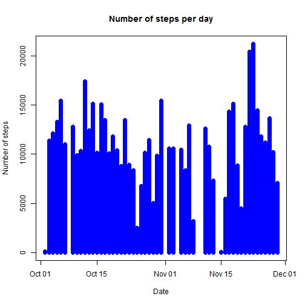
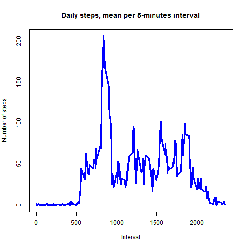
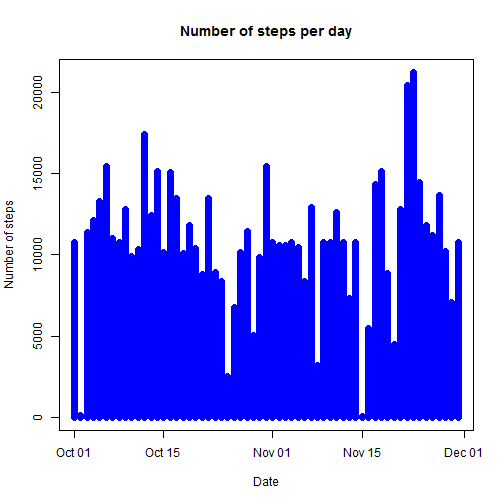
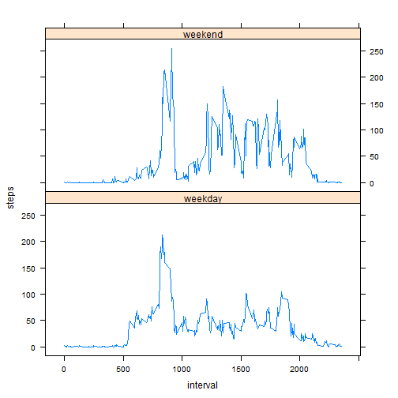

The project is an elaboration of data about personal activity. The dataset include variables on:

- <b>steps</b>: Number of steps taking in a 5-minute interval
- <b>date</b>: The date of the measurements in YYYY-MM-DD format
- <b>interval</b>: Identifier for the 5-minute interval in which measurement was taken

The dataset is stored in a comma-separated-value (CSV) file and there are a total of 17,568 observations in this dataset.


**Loading and preprocessing data**

In the first step, the data were loaded and preprocessed in order to be elaborated in the r programming language.


```r
download.file("http://d396qusza40orc.cloudfront.net/repdata%2Fdata%2Factivity.zip", destfile="./repdata-data-activity.zip")
unzip("./repdata-data-activity.zip")
data <- read.csv("activity.csv")
data$date <- as.character(data$date)
data$date <- as.Date(data$date, "%Y-%m-%d")
```

**A glance on the data**

```r
head(data)
```

```
##   steps       date interval
## 1    NA 2012-10-01        0
## 2    NA 2012-10-01        5
## 3    NA 2012-10-01       10
## 4    NA 2012-10-01       15
## 5    NA 2012-10-01       20
## 6    NA 2012-10-01       25
```

```r
str(data)
```

```
## 'data.frame':	17568 obs. of  3 variables:
##  $ steps   : int  NA NA NA NA NA NA NA NA NA NA ...
##  $ date    : Date, format: "2012-10-01" "2012-10-01" ...
##  $ interval: int  0 5 10 15 20 25 30 35 40 45 ...
```

**What is mean total number of steps taken per day?**

The first step has been to calculate the mean and the median number of steps taken per day.

The sum of steps for each day has been calculated and stored in the data frame <b>sumsteps</b>. An histogram of those data has been plotted.


```r
sumsteps <- aggregate(data$steps ~ data$date, FUN="sum", na.rm=T)
names(sumsteps) <- c("date", "steps")
head(sumsteps)
```

```
##         date steps
## 1 2012-10-02   126
## 2 2012-10-03 11352
## 3 2012-10-04 12116
## 4 2012-10-05 13294
## 5 2012-10-06 15420
## 6 2012-10-07 11015
```

```r
plot(sumsteps$date, sumsteps$steps, type="h", lwd=7, col="blue", main = "Number of steps per day", xlab = "Date", ylab = "Number of steps")
```

 


The mean of the total steps per day has been calculated and stored in the variable <b>meansumsteps</b>.


```r
meansumsteps <- mean(sumsteps$steps, na.rm=T)
meansumsteps
```

```
## [1] 10766.19
```
The median of the total steps per day has been calculated and store in the variable <b>mediansumsteps</b>.

```r
mediansumsteps <- median(sumsteps$steps, na.rm=T)
mediansumsteps
```

```
## [1] 10765
```

There is little difference between the mean and the median. 

**What is the average daily activity pattern?**

The next step has been to calculate the mean for each 5-minute interval of activity and to identify the interval that contains the maximum number of steps. 

The mean for each 5-minute interval has been calculated and stored in the data frame <b>intervalmean</b>.  


```r
intervalmean <- aggregate(data$steps ~ data$interval, FUN="mean", na.rm=T)
names(intervalmean) <- c("interval", "steps")
head(intervalmean)
```

```
##   interval     steps
## 1        0 1.7169811
## 2        5 0.3396226
## 3       10 0.1320755
## 4       15 0.1509434
## 5       20 0.0754717
## 6       25 2.0943396
```
 
The mean for each 5-minute interval has then been plotted

```r
plot(intervalmean$interval, intervalmean$steps, type="l", lwd=3, col="blue", main = "Daily steps, mean per 5-minutes interval", xlab = "Interval", ylab="Number of steps")  
```

 
  
The maximum average mean of steps is 206.1698 in the interval 835. 

```r
intervalmean[intervalmean$steps == max(intervalmean$steps),]
```

```
##     interval    steps
## 104      835 206.1698
```

**Imputing missing values**

A second data frame, <b>data1</b>, has been created in order to impute missing values. Each NA has been substituted with the mean of the corresponding interval.

```r
data1 <- data
for (i in 1:17568)
  {
		if (is.na(data1$steps[i])==T)
			{
				data1$steps[i] <- intervalmean$steps[intervalmean$interval == data$interval[i]]
			}
	}
head(data)
```

```
##   steps       date interval
## 1    NA 2012-10-01        0
## 2    NA 2012-10-01        5
## 3    NA 2012-10-01       10
## 4    NA 2012-10-01       15
## 5    NA 2012-10-01       20
## 6    NA 2012-10-01       25
```

```r
head(intervalmean)
```

```
##   interval     steps
## 1        0 1.7169811
## 2        5 0.3396226
## 3       10 0.1320755
## 4       15 0.1509434
## 5       20 0.0754717
## 6       25 2.0943396
```

```r
head(data1)
```

```
##       steps       date interval
## 1 1.7169811 2012-10-01        0
## 2 0.3396226 2012-10-01        5
## 3 0.1320755 2012-10-01       10
## 4 0.1509434 2012-10-01       15
## 5 0.0754717 2012-10-01       20
## 6 2.0943396 2012-10-01       25
```

The total steps per day has been recalculated and stored in the data frame <b>sumsteps1</b>. The new data have been plotted.

```r
sumsteps1 <- aggregate(data1$steps ~ data1$date, FUN="sum", na.rm=T)
names(sumsteps1) <- c("date", "steps")
head(sumsteps1)
```

```
##         date    steps
## 1 2012-10-01 10766.19
## 2 2012-10-02   126.00
## 3 2012-10-03 11352.00
## 4 2012-10-04 12116.00
## 5 2012-10-05 13294.00
## 6 2012-10-06 15420.00
```


```r
plot(sumsteps1$date, sumsteps1$steps, type="h", lwd=7, col="blue", main = "Number of steps per day", xlab = "Date", ylab = "Number of steps")
```

 
  
The mean and the median of the total steps per day have been recalculated with the new data and compared with the old data.

```r
meansumsteps1 <- mean(sumsteps1$steps, na.rm=T)
mediansumsteps1 <- median(sumsteps1$steps, na.rm=T)
```


The <i>old</i> mean of the total steps per day is 

```
## [1] 10766.19
```


The <i>new</i> mean is

```
## [1] 10766.19
```


The <i>old</i> median of the total steps per day is

```
## [1] 10765
```


The <i>new</i> median is

```
## [1] 10766.19
```


The means are the same, meanwhile the new median is higher and is equal to the mean

**Are there differences in activity patterns between weekdays and weekends?**


The dates of the measurements have been divided in two categories, weekday and weekend. For each category has been plotted the number of steps per each 5-minute interval.


```r
days <- rep(" ", 17568)
for (i in 1:17568)
      {
            if (weekdays(data1$date[i]) == "Saturday" | weekdays(data1$date[1]) == "Sunday") 
              {days[i]="weekend"} 
            else 
              {days[i] ="weekday"}
      }
data1$weekday <- days
weekmean <- aggregate(data1$steps ~ data1$interval + data1$weekday, FUN = "mean")
names(weekmean) <- c("interval", "weekday", "steps")
library(lattice)
xyplot(steps~interval|weekday, data=weekmean, type="l", layout=c(1,2))
```

 
